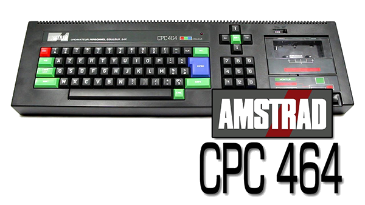

<b>Infos:</b>

Die Amstrad CPC-Serie, im deutschsprachigen Raum besser als Schneider CPC bekannt, war eine in den 1980er Jahren populäre Baureihe untereinander weitgehend kompatibler 8-Bit-Heimcomputer, die auf der damals weit verbreiteten Z80-CPU basierte und u. a. in Westeuropa größere Verbreitung fand. Entwickelt wurden die CPCs von der britischen Firma Amstrad, die sie in Fernost, u. a. von Orion, als Auftragsarbeit bauen ließ. Die Bezeichnung CPC leitet sich vom englischen Colour Personal Computer ab. 

Die Rechner wurden als Komplettpaket mit umfangreicher Hardwareausstattung verkauft: Enthalten waren der eigentliche Rechner mit integrierter Tastatur und Laufwerk (Kompaktkassette beim CPC464 und 464Plus, 3″-Diskette bei den anderen Modellen), ein Farb- oder ein Monochrommonitor (grün bei den klassischen und schwarzweiß bei den Plus-Modellen) mit integriertem Netzteil, mehrere kurze Verbindungskabel, ein ausführliches Handbuch, eine CP/M-Bootdiskette sowie eine Diskette mit Programmen bzw. eine Demokassette. Ein Fernseher konnte über einen als Zubehör erhältlichen Adapter angeschlossen werden. Jedoch lieferte der mitgelieferte RGB-Monitor ein wesentlich besseres Bild als ein Fernseher. Je nach Modell und Ausstattung war der Verkaufspreis vergleichbar oder deutlich niedriger als der eines C64, bei dem Monitor und Disketten-Laufwerk in der Regel als Zubehör erworben werden mussten.

Da Amstrad in Deutschland über keine Vertriebsstrukturen verfügte, übernahm die Schneider Computer Division, eine eigens zu diesem Zweck gegründete Tochter der Schneider Rundfunkwerke AG, den Vertrieb unter der Bezeichnung Schneider CPC für die Länder Deutschland, Österreich und die Schweiz. Nachdem Amstrad und Schneider 1988 die Zusammenarbeit beendet hatten, verkaufte Amstrad auch in diesen Ländern die CPC-Serie unter eigenem Namen, was mit erheblichen Anlaufschwierigkeiten verbunden war, da Amstrad bis zu diesem Zeitpunkt nach wie vor nicht selbst in Deutschland vertreten war. Deshalb und weil der Zenit der CPCs bereits überschritten war, stammen die meisten in Deutschland verkauften CPCs noch von Schneider. In den meisten anderen Ländern wurden CPCs bereits zuvor unter der Bezeichnung Amstrad CPC verkauft. 
